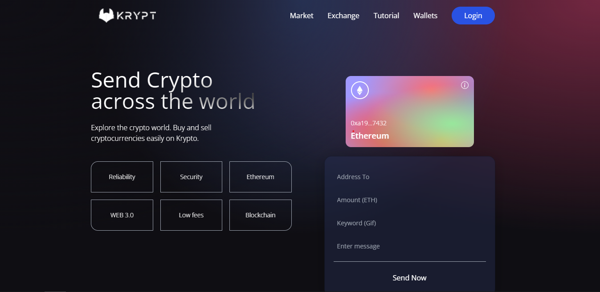

<h1 align="center">
   
  
   
</h1>

Web3 Application built using Web3 methodologies, Solidity and Metamask.

  

    

 

## :hammer: Tecnologias

Este projeto foi desenvolvido com as seguintes tecnologias:

- HTML5
- CSS
- React
- TypeScript
- Web3
- Solidity
- Blockchain

## 🚀 Execute o projeto

1. Clone este repositório `git clone https://github.com/dudunog/krypt-app.git`
2. Entre no diretório do projeto `cd krypt-app`
3. Entre no diretório `client` com `cd client`
4. Instale as dependências com `yarn install` ou `npm install`
5. Crie um arquivo `.env` com a chave `VITE_GIPHY_API=token` e seu token do Giphy
6. Inicie o projeto com `yarn run dev` ou `npm run dev`
